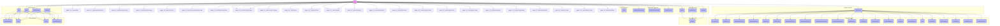

```mermaid
flowchart TD

classDef entity fill:#f9f,stroke:#333,stroke-width:1px;
classDef process fill:#bbf,stroke:#333,stroke-width:1px;
classDef datastore fill:#bfb,stroke:#333,stroke-width:1px;

    User([User]):::entity
    User --> pages_FE_SuperAdmin
    User --> pages_FE_SystemAdministration
    User --> pages_FE_AddSystemInventory
    User --> pages_FE_EditSystemInventory
    User --> pages_FE_SystemContext
    User --> pages_FE_SystemInventoryMasterTable
    User --> pages_FE_AddTaskClosureForm
    User --> pages_FE_ProfileIconWithLogout
    User --> pages_FE_TaskClosureTracking
    User --> pages_FE_TaskContext
    User --> pages_FE_TaskDetailView
    User --> pages_FE_TrackRequest
    User --> pages_FE_TrackRequest
    User --> pages_FE_UserInformation
    User --> pages_FE_UserManagement
    User --> pages_FE_UserMasterTable
    User --> pages_FE_UserRequestContext
    User --> pages_FE_UserRequestForm
    User --> pages_FE_ProfileIconWithLogout
    User --> pages_FE_UserRequestTable
    User --> pages_FE_AddVendorMaster
    User --> pages_FE_ConfirmLoginModal
    User --> pages_FE_EditVendorMaster
    User --> pages_FE_VendorContext
    User --> pages_FE_ProfileIconWithLogout
    User --> pages_FE_VendorMasterTable
    User --> pages_FE_WorkflowBuilder
subgraph Frontend_RoleMaster["RoleMaster Frontend"]
    RoleMaster_FE_AddRoleFormPage(AddRoleFormPage):::process
    RoleMaster_FE_EditRoleFormPage(EditRoleFormPage):::process
    RoleMaster_FE_RolesContext(RolesContext):::process
end

    User --> RoleMaster_FE_AddRoleFormPage
    User --> RoleMaster_FE_EditRoleFormPage
    User --> RoleMaster_FE_RolesContext
subgraph Frontend_routes["routes Frontend"]
    routes_FE_AppRoutes(AppRoutes):::process
end

subgraph Backend_routes["routes Backend"]
    routes_BE_accessLog(accessLog):::process
    routes_BE_activityLog(activityLog):::process
    routes_BE_applicationRoutes(applicationRoutes):::process
    routes_BE_approvalRoutes(approvalRoutes):::process
    routes_BE_approvals(approvals):::process
    routes_BE_authRoutes(authRoutes):::process
    routes_BE_dashboardRoutes(dashboardRoutes):::process
    routes_BE_departmentRoutes(departmentRoutes):::process
    routes_BE_employeeSyncRoutes(employeeSyncRoutes):::process
    routes_BE_permissionInspector(permissionInspector):::process
    routes_BE_plantRoutes(plantRoutes):::process
    routes_BE_roleRoutes(roleRoutes):::process
    routes_BE_serverRoutes(serverRoutes):::process
    routes_BE_serviceRequest(serviceRequest):::process
    routes_BE_swagger(swagger):::process
    routes_BE_systemRoutes(systemRoutes):::process
    routes_BE_task(task):::process
    routes_BE_transaction(transaction):::process
    routes_BE_userRequest(userRequest):::process
    routes_BE_userRoutes(userRoutes):::process
    routes_BE_vendorRoutes(vendorRoutes):::process
    routes_BE_workflowRoutes(workflowRoutes):::process
end

    User --> routes_FE_AppRoutes
    routes_FE_AppRoutes --> routes_BE_accessLog
    routes_FE_AppRoutes --> routes_BE_activityLog
    routes_FE_AppRoutes --> routes_BE_applicationRoutes
    routes_FE_AppRoutes --> routes_BE_approvalRoutes
    routes_FE_AppRoutes --> routes_BE_approvals
    routes_FE_AppRoutes --> routes_BE_authRoutes
    routes_FE_AppRoutes --> routes_BE_dashboardRoutes
    routes_FE_AppRoutes --> routes_BE_departmentRoutes
    routes_FE_AppRoutes --> routes_BE_employeeSyncRoutes
    routes_FE_AppRoutes --> routes_BE_permissionInspector
    routes_FE_AppRoutes --> routes_BE_plantRoutes
    routes_FE_AppRoutes --> routes_BE_roleRoutes
    routes_FE_AppRoutes --> routes_BE_serverRoutes
    routes_FE_AppRoutes --> routes_BE_serviceRequest
    routes_FE_AppRoutes --> routes_BE_swagger
    routes_FE_AppRoutes --> routes_BE_systemRoutes
    routes_FE_AppRoutes --> routes_BE_task
    routes_FE_AppRoutes --> routes_BE_transaction
    routes_FE_AppRoutes --> routes_BE_userRequest
    routes_FE_AppRoutes --> routes_BE_userRoutes
    routes_FE_AppRoutes --> routes_BE_vendorRoutes
    routes_FE_AppRoutes --> routes_BE_workflowRoutes
subgraph Frontend_shared["shared Frontend"]
    shared_FE_global(global):::process
    shared_FE_permissions(permissions):::process
    shared_FE_subjects(subjects):::process
end

subgraph Backend_shared["shared Backend"]
    shared_BE_abilities(abilities):::process
end

    User --> shared_FE_global
    shared_FE_global --> shared_BE_abilities
    User --> shared_FE_permissions
    shared_FE_permissions --> shared_BE_abilities
    User --> shared_FE_subjects
    shared_FE_subjects --> shared_BE_abilities
subgraph Frontend_types["types Frontend"]
    types_FE_index(index):::process
end

    User --> types_FE_index
subgraph Frontend_utils["utils Frontend"]
    utils_FE_api(api):::process
    utils_FE_rbac(rbac):::process
    utils_FE_workflowApi(workflowApi):::process
    utils_FE_zingApi(zingApi):::process
end

subgraph Backend_utils["utils Backend"]
    utils_BE_activityLogger(activityLogger):::process
    utils_BE_audit(audit):::process
    utils_BE_email(email):::process
    utils_BE_emailTemplate(emailTemplate):::process
end

    User --> utils_FE_api
    utils_FE_api --> utils_BE_activityLogger
    utils_FE_api --> utils_BE_audit
    utils_FE_api --> utils_BE_email
    utils_FE_api --> utils_BE_emailTemplate
    User --> utils_FE_rbac
    utils_FE_rbac --> utils_BE_activityLogger
    utils_FE_rbac --> utils_BE_audit
    utils_FE_rbac --> utils_BE_email
    utils_FE_rbac --> utils_BE_emailTemplate
    User --> utils_FE_workflowApi
    utils_FE_workflowApi --> utils_BE_activityLogger
    utils_FE_workflowApi --> utils_BE_audit
    utils_FE_workflowApi --> utils_BE_email
    utils_FE_workflowApi --> utils_BE_emailTemplate
    User --> utils_FE_zingApi
    utils_FE_zingApi --> utils_BE_activityLogger
    utils_FE_zingApi --> utils_BE_audit
    utils_FE_zingApi --> utils_BE_email
    utils_FE_zingApi --> utils_BE_emailTemplate

```